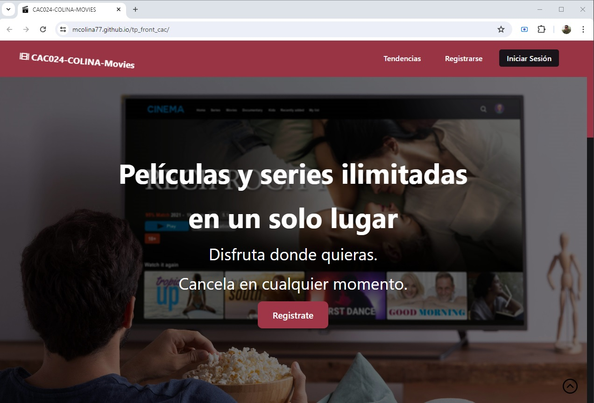
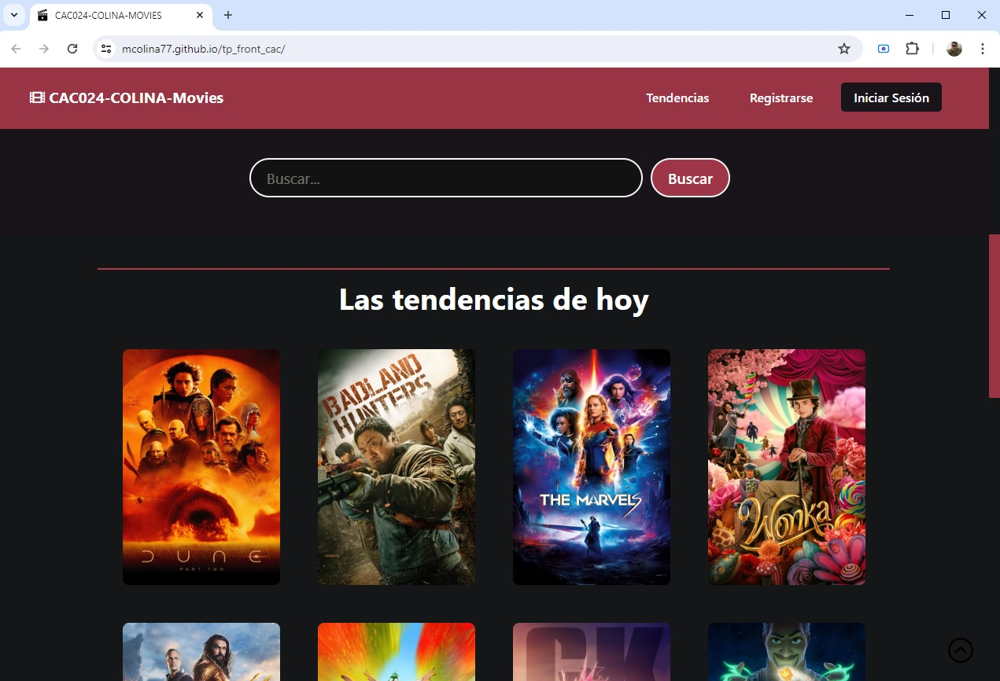
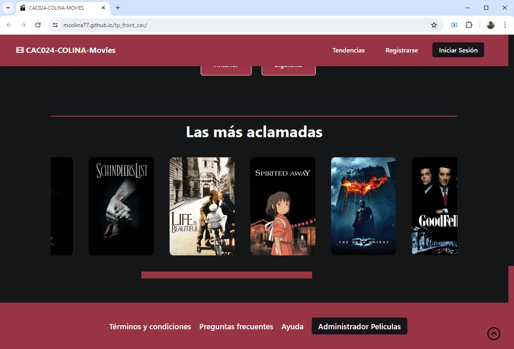

# Proyecto de Frontend para el curso de Codo a Codo 2024
La consigna fue clonar un sitio de presentación y reseña de películas en la web. Se podía utilizar solamente HTML y CSS, con lo visto en el curso de **Codo a Codo Java** 2024 - siendo de la **Comisión 24106**

## Algunas imágenes de cómo se ve el Proyecto

Puedes acceder al proyecto desde **[AQUÍ](https://mcolina77.github.io/tp_front_cac/)**
